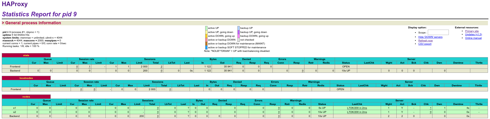

#Task 0
## Questions :

### 1)
We can't use the current solution in a production environment.
This is due to the lack of a scaling mechanism. 
Indeed, the current 2 web app containers would instantly be at full load if they were to be deployed to production.

### 2)

You would need to add the following lines to the `.env` file :
```
WEBAPP_3_NAME=s3
WEBAPP_3_IP=192.168.42.33
```

As well as adding the following lines to the `docker-compose.yml` file, before the `haproxy` service :
```
  webapp3:
       container_name: ${WEBAPP_3_NAME}
       build:
         context: ./webapp
         dockerfile: Dockerfile
       networks:
         heig:
           ipv4_address: ${WEBAPP_3_IP}
       ports:
         - "4001:3000"
       environment:
            - TAG=${WEBAPP_3_NAME}
            - SERVER_IP=${WEBAPP_3_IP}
```

Add the following lines to environment field of the `haproxy` service, in the `docker-compose.yml` :
```
            - WEBAPP_3_IP=${WEBAPP_3_IP}
```

And finally, add the following line at the end of the backend nodes section of the `haproxy` config file, found at `ha/config/haproxy.cfg` :
```
    server s3 ${WEBAPP_3_IP}:3000 check
```

### 3)
We could use a host script to spin up or downsome more nodes, and use a comunication mechanism to communicate with HAProxy to update it's running configuration to account for the newly available nodes.

### 4)
We could probably use HA's Runtime API to manage the proxy in an asynchronous fashion to add or remove nodes to the proxy's config.
Or, at least we would be able to do so, if the currently used HA proxy's version was at least 1.8 (it's 1.5).

Use Traefik instead of HAProxy to solve this problem is a much cleaner fashion....

### 5)
Our current solution is unable to run multiple processes, due to relying on the default docker behaviours.
Indeed, currently, the dockerfile starts the webserver in a blocking fashion. We would need to use a mechanism to start multiple processes at the start of a container.

### 6)
This is wrong. The script doesn't end up achieving anything, since there is no `<s1>` on the haproxy.cfg file. as such, nothing happens if we add more nodes. it's not dynamic since it doesn't do anyting.
A better solution would be to replace HAproxy with Traefik

##Deliverables :

###1)
Voici la capture d'écran de HA proxy



###2)
Voici l'URL de mon URL de repo : 
https://github.com/capito27/Teaching-HEIGVD-AIT-2019-Labo-Docker