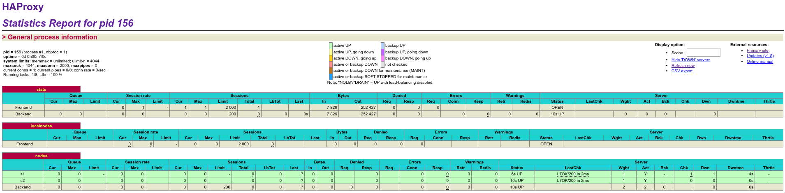

# Task 1

## Déliverables 
### 1)

Voici la capture d'écran de HA proxy

### 2

Nos difficultés dans cette tache sont principalement dues au fait que la plupart des commandes ne peuvent pas être exécutées directement sous la forme fournie.
Plus sérieusement, l'utilité principale de l'installation de ce superviseur dans le contexte d'un conteneur docker, est le redémarrage automatique de certains daemons et services, dans le cas où le serveur webapp crash, il sera redémarré automatiquement.

Selon nous, une telle solution n'est pas appropriée. En effet, il se peut que le serveur crash de telle façon à ce qu'il corrompe le conteneur. 
Pour palier à ce problème, il faudrait utiliser les comportements de base de  docker compose, qui permet de recréer automatiquement un container avec l'image sous-jacente si celui-ci se crash.
