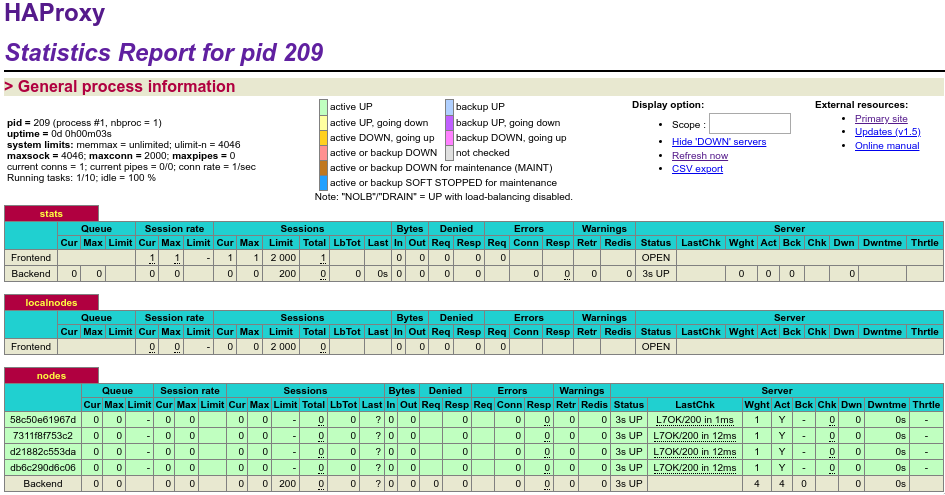
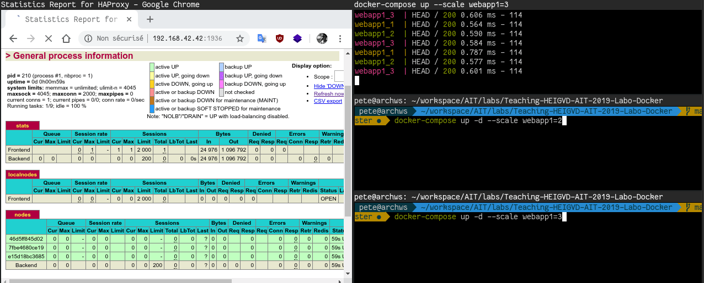

# Task 6

## Déliverables 

###1)

Voici la capture d'écran : 



###2)

Pour faire fonctionner le scaling facilement avec docker compose et son option `--scale`, il a été nécessaire de nettoyer grandement la configuration. Serf permet un système hautement dynamique, il faut donc permet docker-compose de l'être aussi. Pour ce faire, on supprime webapp2 (s2) et on supprime tout les informations static. Docker s'occupera de donner une IP a chaque container dans le réseau "heig", le haproxy reste en static. Cette solution, nous fait perdre du controle sur l'accès individuel des containers.

```
services :
  webapp1:
       build:
         context: ./webapp
         dockerfile: Dockerfile
       networks:
         - heig
```

On peut alors lancer N container comme ceux-ci `docker-compose up --scale webapp1=N` et de varier le nombre comme ceux-ci `docker-compose up -d --scale webapp1=N`.

Concernant la solution final, nous trouvons lourd que le processus HAProxy soit redémmarer à chaque arrivée/départ de serveur. Il serait intéressant de faire un "reload" si c'est possible pour éviter un travail trop lourd pour cela. Nous trouvons cela scandaleux d'installer NodeJS pour faire du templating, des outils simples comme `sed` serait totalement suffisant ! Le service Serf est très intéressant pour permettre ces prises de connaissance entre machine et semble un processus léger. Mais ce service nécessite d'aller à l'encontre de la philosophie Docker et donc que le container a connaissance du HAProxy. L'alternative Traefik permet de ne pas avoir le besoin d'ajouter de service dans le docker et donc simplifier le fonctionnement globale. L'insertion d'un nouveau service de webapp est donc beaucoup moins contraignant via Traefik.

###3)

Voici la démo de l'ajout et supression de noeud
